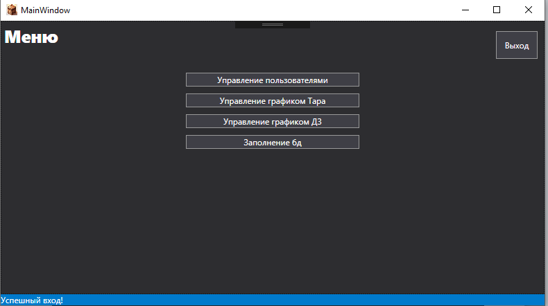
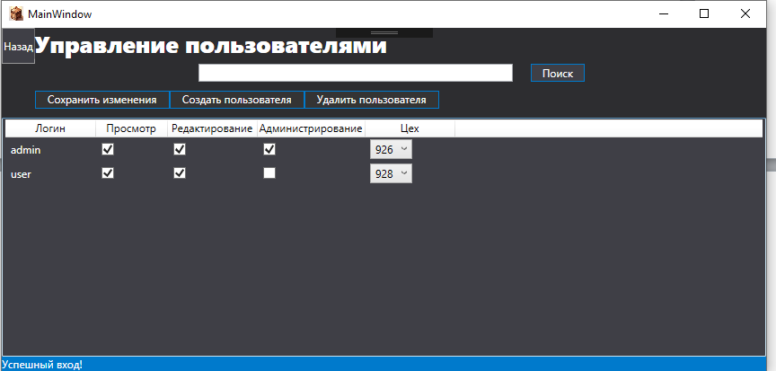
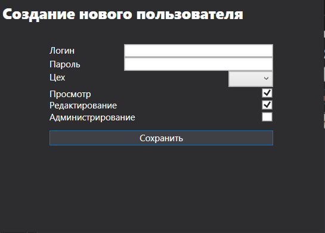
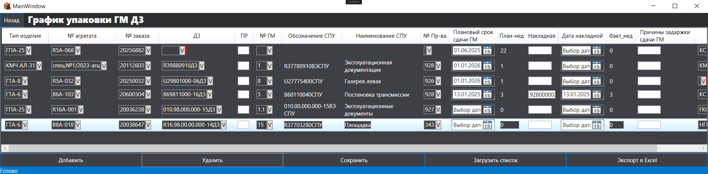
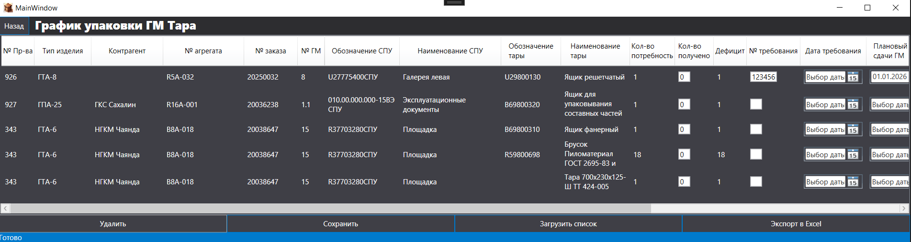

# PackingGM
Дипломная работа. График упаковки грузовых мест

WPF-приложение для автоматизации учета и управления графиком упаковки грузовых мест на предприятии АО «ОДК-Газовые турбины». Система позволяет создавать, редактировать и распределять грузовые места по спецификациям упаковки.

## Технологии
Backend: C# .NET, WPF, Entity Framework 6

Database: PostgreSQL

Архитектура: MVVM (Model-View-ViewModel)

ORM: Entity Framework Code First с миграциями

## Функциональность
- Управление грузовыми местами (создание/редактирование/удаление)

- Автоматическое создание тары при добавлении грузовых мест

- Разграничение прав доступа по ролям пользователей

- Интеграция с корпоративной системой TechnologiCS

- Валидация данных при импорте из Excel

Структура базы данных

### Основные таблицы:

- GMs - грузовые места

- GMTares - связь грузовых мест с тарой

- Orders - заказы

- Aggregates - агрегаты

- SPUs - спецификации упаковки

- Users - пользователи

- Manufactories - цеха

### Интерфейс
- Главное меню

- Страница управления пользователями

- Добавление пользователя

- Страница управления графиком грузовых мест

- Страница управления тарой
